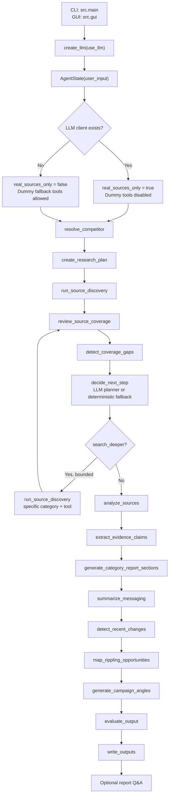

# Competitive Intel Agent

Local prototype of a bounded competitive marketing research agent for GTM competitive intelligence. Given a target company name or domain, it gathers public-source evidence, produces category-specific research sections, maps grounded Rippling market opportunities, and writes a markdown brief plus structured JSON and run logs.

The project supports both deterministic offline runs and LLM-backed real-source runs:

- No-LLM runs can use deterministic dummy fallback tools for offline testing.
- LLM runs use real-source mode and disable dummy source tools so generated reports do not mix real evidence with fixtures.

## Current Capabilities

- Resolve a target company from a name or domain.
- Build a bounded research plan across website positioning, product pages, pricing, paid ads, social, press/news, and comparison pages.
- Collect public evidence through a category-scoped tool registry.
- Review source coverage and optionally run one bounded deeper search cycle.
- Extract grounded claims and confidence scores from discovered sources.
- Generate detailed category report sections with inline numeric citations.
- Generate Rippling market opportunities from static Rippling positioning plus grounded competitor evidence.
- Generate campaign angles from mapped opportunities.
- Evaluate grounding, coverage, caveats, public-source compliance, and recommendation specificity.
- Write markdown, JSON, and run-log outputs.
- Track provider-reported LLM input/output token usage.
- Support optional post-report Q&A from the CLI or GUI.

## Outputs

Each run writes files under `outputs/` unless another output directory is passed:

- `outputs/{competitor}_brief.md`: final markdown competitive brief.
- `outputs/{competitor}_data.json`: structured report data, compact tool logs, LLM call logs, token usage fields, report Q&A logs, claims, opportunities, recommendations, and eval summary.
- `outputs/{competitor}_run.log`: detailed run log with pipeline logs, tool calls, raw API request/response blocks where available, LLM responses, token usage summary, and generated file paths.

Generated markdown reports end with an `LLM Token Usage` section:

- Input tokens
- Output tokens
- Total tokens
- Calls with provider-reported usage
- Calls without provider-reported usage

Providers or test doubles that do not return usage are counted separately as calls without provider-reported usage.

## Quick Start

Windows PowerShell:

```powershell
py -3 -m venv .venv
.\.venv\Scripts\Activate.ps1
python -m pip install --upgrade pip
python -m pip install -r requirements.txt
python -m src.main --competitor "Gusto" --no-llm
python -m pytest
```

macOS / Linux:

```bash
python3 -m venv .venv
source .venv/bin/activate
python -m pip install --upgrade pip
python -m pip install -r requirements.txt
python -m src.main --competitor "Gusto" --no-llm
python -m pytest
```

The `.venv/` directory is ignored by git.

## CLI Commands

Run deterministic offline mode:

```powershell
.\.venv\Scripts\python.exe -m src.main --competitor "Gusto" --no-llm
```

Run with the configured LLM and real source tools:

```powershell
.\.venv\Scripts\python.exe -m src.main --competitor "Gusto" --use-llm
```

Run with post-report Q&A:

```powershell
.\.venv\Scripts\python.exe -m src.main --competitor "Gusto" --use-llm --interactive
```

Write outputs to a custom directory:

```powershell
.\.venv\Scripts\python.exe -m src.main --competitor "Gusto" --no-llm --output-dir outputs
```

## GUI Mode

The CLI remains the default run path, but the repo also includes a simple Tkinter desktop UI:

```powershell
.\.venv\Scripts\python.exe -m src.gui
```

The GUI lets you:

- Enter the target company in the UI.
- Choose `Auto`, `Use LLM`, or `No LLM`.
- Run the same `run_graph` pipeline as the CLI.
- Read the generated markdown in a styled report pane.
- Inspect run details, coverage, tool calls, eval scores, and token totals.
- Ask follow-up report questions after an LLM-backed run.
- Open the generated markdown file or output folder.

The GUI writes the same markdown, JSON, and run-log files as the CLI.

## Architecture

The canonical orchestration lives in `src/graph.py`.



Pipeline stages:

1. `resolve_competitor`: normalizes user input into a `CompetitorProfile`.
2. `create_research_plan`: creates bounded research tasks for all source categories.
3. `run_source_discovery`: calls only category-allowed tools from `src/tools/registry.py`.
4. `review_source_coverage`: builds source inventory and per-category coverage status.
5. `detect_coverage_gaps`: records weak or missing categories and suggested next tools.
6. `decide_next_step`: uses a validated LLM planner when available, otherwise deterministic logic.
7. Optional bounded replanning: one deeper source-discovery pass for a specific category/tool.
8. `analyze_sources`: converts source content into observations and themes.
9. `extract_evidence_claims`: creates grounded claims with supporting source IDs.
10. `generate_category_report_sections`: writes detailed category sections with citations.
11. `summarize_messaging`: summarizes themes and positioning.
12. `detect_recent_changes`: identifies recent public-source messaging signals.
13. `map_rippling_opportunities`: creates canonical Rippling opportunity records.
14. `generate_campaign_angles`: turns opportunities into campaign recommendations.
15. `evaluate_output`: scores quality, grounding, coverage, caveats, and compliance.
16. `write_outputs`: writes markdown, JSON, and run logs.

## Source Categories And Tools

Source discovery is category-scoped through `src/tools/registry.py`.

| Category | Real tools | Dummy fallback in no-LLM mode |
| --- | --- | --- |
| `website_positioning` | Exa company domain resolver, Exa website positioning | Web search, webpage scraper, homepage, product page, sitemap, landing page fixtures |
| `product_pages` | Exa company domain resolver, Exa product pages | Web search, webpage scraper, product page, sitemap fixtures |
| `pricing` | Exa company domain resolver, Exa pricing research | Web search, webpage scraper, pricing page, pricing FAQ, third-party pricing fixtures |
| `paid_ads` | Exa company domain resolver, Adyntel Meta, LinkedIn, Google ads | Meta ad library and Google ads fixtures |
| `social` | Exa LinkedIn resolver, Apify LinkedIn posts, Exa X/Twitter resolver, Apify X/Twitter posts | Twitter and LinkedIn fixtures |
| `press_news` | Exa company domain resolver, Exa press/news | Web search, news search, press release fixtures |
| `comparison_pages` | None currently | Web search, webpage scraper, comparison page fixtures |

Real-source mode filters out all dummy tools. Missing API keys, cache misses, and real tool failures are logged as gaps instead of being silently backfilled with fixture evidence.

## Real API Tools

### Exa

Exa is used for:

- Company domain resolution.
- LinkedIn company page resolution.
- X/Twitter handle resolution.
- Website positioning research.
- Product page research.
- Pricing research.
- Press/news research.
- Follow-up report Q&A searches.

Page-research tools prefer official competitor domains when a domain is known or resolved. If official pages do not return usable evidence, tools can fall back to external public sources. External evidence is marked third-party and receives lower confidence.

Press/news searches use Exa's `news` category for external results and default to the last 18 months.

### Apify

The social discovery category can call Apify actors for public company posts:

- LinkedIn company posts:
  `https://api.apify.com/v2/acts/automation-lab~linkedin-company-posts-scraper/run-sync-get-dataset-items`
- X/Twitter posts:
  `https://api.apify.com/v2/acts/simpleapi~x-twitter-posts-search/run-sync-get-dataset-items`

Before Apify runs, Exa resolves the official LinkedIn company page or X/Twitter handle. If required context is missing, the dependent Apify tool is skipped and logged.

### Adyntel

The paid ads category can call Adyntel for public ad-library results:

- `POST https://api.adyntel.com/facebook`
- `POST https://api.adyntel.com/linkedin`
- `POST https://api.adyntel.com/google`

Before Adyntel runs, the source agent resolves or normalizes the competitor domain.

## Environment Variables

Core LLM controls:

```text
USE_LLM=auto
LLM_PROVIDER=auto
```

Anthropic first-party API:

```text
LLM_PROVIDER=anthropic
ANTHROPIC_API_KEY=...
ANTHROPIC_BASE_URL=
ANTHROPIC_VERIFY_SSL=true
ANTHROPIC_MODEL=claude-sonnet-5
ANTHROPIC_MAX_TOKENS=8000
ANTHROPIC_THINKING=disabled
ANTHROPIC_EFFORT=
```

Anthropic-compatible QGenie gateway:

```text
LLM_PROVIDER=qgenie
ANTHROPIC_AUTH_TOKEN=...
ANTHROPIC_BASE_URL=https://qgenie-api.qualcomm.com/
ANTHROPIC_VERIFY_SSL=false
ANTHROPIC_MODEL=claude-opus-4-8
ANTHROPIC_MAX_TOKENS=8000
ANTHROPIC_THINKING=disabled
```

Groq:

```text
LLM_PROVIDER=groq
GROQ_API_KEY=...
GROQ_MODEL=llama-3.3-70b-versatile
GROQ_OPENAI_BASE_URL=https://api.groq.com/openai/v1
```

Google AI Studio / Gemini:

```text
LLM_PROVIDER=google
GEMINI_API_KEY=...
GEMINI_MODEL=gemini-3.5-flash
GEMINI_OPENAI_BASE_URL=https://generativelanguage.googleapis.com/v1beta/openai/
```

OpenAI:

```text
LLM_PROVIDER=openai
OPENAI_API_KEY=...
OPENAI_MODEL=gpt-5.5
OPENAI_BASE_URL=
```

Source APIs:

```text
EXA_API_KEY=...
APIFY_TOKEN=...
ADYNTEL_EMAIL=...
ADYNTEL_API_KEY=...
ADYNTEL_BASE_URL=https://api.adyntel.com
```

Cost and cache controls:

```text
AGENT_CACHE_DIR=.agent_cache
EXA_RESEARCH_MAX_RESULTS=5
EXA_RESEARCH_CACHE_TTL_HOURS=24
EXA_RESEARCH_CONTENT_MAX_AGE_HOURS=24
EXA_PRESS_RECENCY_MONTHS=18
APIFY_LINKEDIN_MAX_POSTS_PER_COMPANY=5
APIFY_LINKEDIN_CACHE_TTL_HOURS=5
APIFY_X_TWITTER_MAX_POSTS=5
APIFY_X_TWITTER_CACHE_TTL_HOURS=5
ADYNTEL_MAX_ADS_PER_PLATFORM=5
ADYNTEL_AD_CACHE_TTL_HOURS=120
```

Never print, commit, or copy real `.env` secrets.

## LLM Behavior

With `LLM_PROVIDER=auto`, provider priority is:

1. Anthropic, when `ANTHROPIC_API_KEY` or `ANTHROPIC_AUTH_TOKEN` is set.
2. Groq.
3. Gemini / Google AI Studio.
4. OpenAI.

With `USE_LLM=auto`, the app uses an LLM only when the selected provider has credentials. CLI flags can override this:

```powershell
.\.venv\Scripts\python.exe -m src.main --competitor "Gusto" --use-llm
.\.venv\Scripts\python.exe -m src.main --competitor "Gusto" --no-llm
```

LLM-backed stages:

- `planner_decision`: validated JSON planner decision.
- `category_report_sections`: one report-section call per populated category.
- `rippling_opportunity_mapper`: validated opportunity mapping from static Rippling positioning and grounded competitor evidence.
- `final_markdown_report`: final narrative synthesis.
- `report_qa_*`: report Q&A routing and answers.

The LLM does not scrape, browse, or call tools directly. Source discovery is performed by the tool registry before the prompt-based stages run.

## Report Assembly Rules

The report writer intentionally separates synthesis from canonical details:

- The final report LLM writes the main narrative and synthesis.
- Category report sections are preserved from category subagents. If the final LLM summarizes or mangles them, `output_writer` replaces the generated block with the preserved sections.
- Rippling's current positioning is static project data for now.
- Rippling positioning gaps and opportunities are owned by `map_rippling_opportunities`, not the final report LLM.
- In LLM runs, opportunity mapping uses a dedicated validated JSON call seeded with static Rippling positioning and grounded competitor evidence.
- If the opportunity mapper LLM call fails or returns invalid data, deterministic fallback mapping keeps the section present.
- Markdown cleanup normalizes malformed headings, source lists, duplicate source blocks, and template placeholders.
- Final markdown always appends provider-reported LLM token totals.

## Cache Model

Real API tools use JSON cache files under `AGENT_CACHE_DIR`, defaulting to `.agent_cache`.

- Company domain, LinkedIn URL, and X/Twitter handle resolution are cached without TTL.
- Exa page research defaults to a 24 hour TTL.
- Apify LinkedIn and X/Twitter post data default to a 5 hour TTL.
- Adyntel ad data defaults to a 120 hour TTL.
- Cache hits are still logged in `tool_call_logs` with cache metadata.

## Report Q&A

Interactive Q&A is available through:

```powershell
.\.venv\Scripts\python.exe -m src.main --competitor "Gusto" --use-llm --interactive
```

or through the GUI after an LLM-backed report run.

The Q&A router chooses between:

- `answer_from_report`: answer using the generated report context only.
- `search_web`: run `ExaFollowUpResearchTool` for missing or newer public-source context, then answer with citations.

Q&A answers, routes, source IDs, and follow-up tool calls are appended to the JSON report and run log.

## Testing

Run the full deterministic suite:

```powershell
.\.venv\Scripts\python.exe -m pytest
```

The tests cover:

- End-to-end pipeline behavior.
- Pydantic schema contracts.
- Source registry boundaries.
- Real-source mode dummy-tool filtering.
- Tool failure logging.
- Exa, Apify, and Adyntel adapter behavior.
- LLM provider selection and wrappers.
- Token usage normalization and report display.
- Category markdown cleanup and report assembly.
- Rippling opportunity mapper validation and fallback.
- Report Q&A routing.
- GUI helper formatting.

## Development Guardrails

- Keep CLI and GUI entry points coexisting; do not break `src.main` when adding UI behavior.
- Keep dummy tools available for no-LLM/offline tests only.
- Do not backfill LLM-backed reports with dummy sources.
- Add focused tests when changing behavior.
- If adding a real API tool, wire it through `src/tools/registry.py`, include redacted request/response logging, add cache behavior, document env vars, and add tests.
- If report structure changes, verify both markdown and JSON because Q&A uses saved report context.
- Preserve cache TTLs as part of the API-cost guardrail model.

## Extension Points

- New source category: update `src/config.py`, schemas if needed, registry bindings, coverage/eval logic, and category-section prompting.
- New API source tool: subclass `BaseSourceTool`, return `ToolResult`, log safe metadata, cache expensive calls, and register it by category.
- New report section: produce structured state first, then render it in `output_writer`.
- New Q&A behavior: update `src/nodes/report_qa.py` and keep the answer/report refresh path intact.
